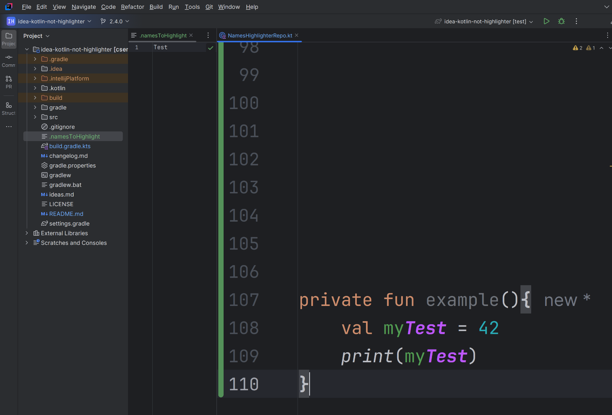

# Overview

A simple plugin that highlights (based on settings)

- !
- "not"
- Disable(d)
- and other types of "negation"

The rational is simple; how often is the "!" hard to spot in an if statement?, or in any other expression?
Even if avoiding ! in most expressions the concept of negation is still "difficult" to grasp, thus the cognitive load of
negation (and keeping track) is still there.
Thus, to give more freedom/help in reading/writing code, these negations are highlighted.

## Custom names to highlight

Adding a file named

```
.namesToHighlight
```

and adding a word on each line, will be picked up by the plugin, and used in highlighting.

A full example


## Development

### Traps

- Test may not be run with adopt open jdk, as that screws up some internal expectancy with how the jdk throws
  exceptions.